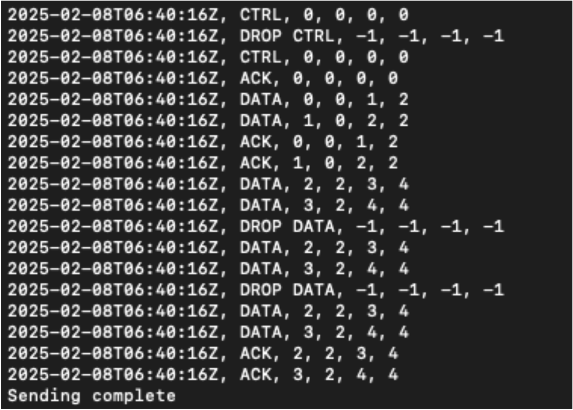
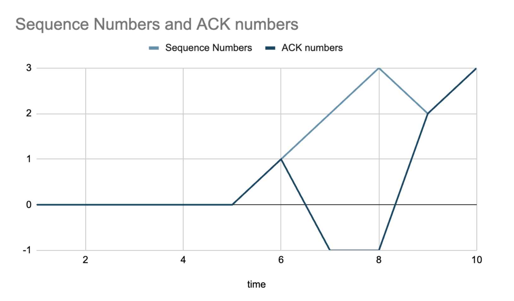

# UDP Safe File Transfer

The tool is meant to mimic the functionality of a file transfer between a client and a server.

## Usage

To generate an executable version of the tool, run "make" at the top level of the lab directory.
This will place two executable files in the bin folder: myserver and myclient.
You can run the tool from the top directory or in the bin directory.
In the case that you are in the bin directory, the tool's usage would be as followed:
    1. Run your server with a desired port:
        ./myserver <serverPort> <dropRate>
    2. Identify server IP address (serverIp).
    3. Run your client against your server with a file of your choice:
        ./myclient <serverIp> <serverPort> <mss> <windowsize> <inputPath> <outputPath>

## Implementation details

Internally, both execeutables are programmed in C++.
The server is programmed to check the command line options, verifying their values.

The server then creates a socket and binds to the configured port.
At that point, the server begins to listen on the port for a client connection.

The client connects by sending a CTRL packet to the server, to which the server will use to
register the client for further data transfer. The server will send an ACK following successful
client registration.

After the ACK is received by the client, the client will send windowsize number of data packets
with a size of MSS (or less). The server receives these are verifies that they are in order. If they
aren’t, the server will drop the packets and notify the client. The client is able to retransmit the
packets that are lost up to 3 times. If the client is still unable to receive complete
acknowledgement from the server after 3 attempts, the client will shut down. (This is based on
Go-Back-N protocol).

At the end of the transmission, the client will send a FIN, which allows the server to free up the
registration overhead of the ex-client.

## Test cases:

### 1. General functionality:
    I ran the server and the client on the same host, testing the functionality with a random test
    file.
    ./client 127.0.0.1 9090 500 2 test.dat output.dat
    ./server 9090 25

### 2. Advanced functionality:
    I ran the client with a small MSS and large MSS for varying test file sizes.
    /client 127.0.0.1 9090 500 2 test.dat output.dat
    /client 127.0.0.1 9090 500 2 small.bin testbin

### 3. Advanced functionality 2:
    I ran the client when the server was down to test if it would time out.
    It would successfully close after attempting to retransmit up to 3 times.

### 4. Improper command line inputs:
    - I did multiple tests for this:
        - Invalid port: ./server test 25
            - Response: Invalid port argument
        - File does not exist: ./client 127.0.0.1 9090 500 2 doesnotexist testbin
            - Response: File does not exist: doesnotexist
        - Missing options: ./client 127.0.0.1 9090 500 test.dat
            - Response: Invalid number of command line arguments
        - Invalid options: /client 127.0.0.1 9090 500 2 test.dat output.dat -random
            - Response: Invalid command line option: -random

### 5. Additional functionality tests:
- I did tests with multiple files of varying sizes, including 0 up to 1GB, as well as different types of files (binary and text).
Everything was also tested with valgrind to ensure that there was no memory loss.

## Analysis logs:

